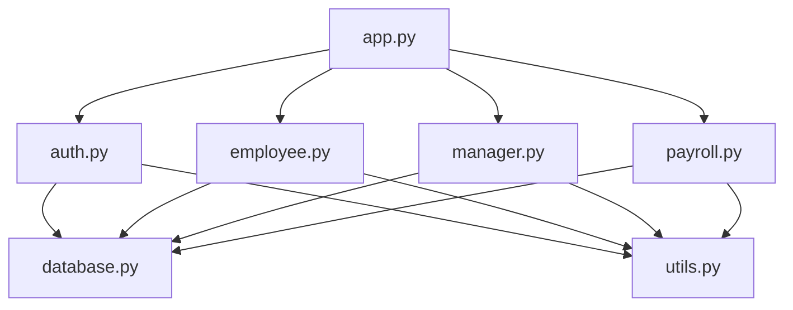

# Hygrometry Inc. Time Tracking and Payroll System

A modular Python web application for recording employee work hours, managing time-off requests, reviewing accepted time records, and transferring approved records into payroll batches.

This project was developed from the Hygrometry Inc. project charter. It uses Flask for the web application, SQLite for local data storage, and Scrum as the project methodology.

## Table of Contents

- [Project Overview](#project-overview)
- [Project Team](#project-team)
- [Charter Requirements](#charter-requirements)
- [Features](#features)
- [Application Architecture](#application-architecture)
- [Project Structure](#project-structure)
- [Database Design](#database-design)
- [Installation](#installation)
- [Demo Accounts](#demo-accounts)
- [Using the Program](#using-the-program)
- [Testing](#testing)
- [Security](#security)
- [Known Limitations](#known-limitations)
- [Troubleshooting](#troubleshooting)
- [Scrum Development Plan](#scrum-development-plan)
- [Future Improvements](#future-improvements)

## Project Overview

Hygrometry Inc. needs one system for employee time tracking and payroll preparation. The organization currently tracks employee time across separate sections. This makes time records, corrections, leave requests, and payroll processing harder to manage.

The Time Tracking and Payroll System gives employees and managers one browser-based application. Employees record hours using their assigned time zone, accept completed records, and submit time-off requests. Managers review those records, correct accepted entries, approve time, and prepare payroll batches.

### Project Purpose

The project improves how Hygrometry Inc. records and manages:

- Employee working hours
- Employee time zones
- Paid and unpaid leave
- Employee acceptance of time records
- Manager reviews and corrections
- Payroll-ready information
- Access to employee and payroll data

### Technology Stack

| Technology | Purpose |
| --- | --- |
| Python 3.10 or newer | Main programming language |
| Flask 3.1 | Web application framework |
| SQLite | Local relational database |
| Jinja | HTML page templates |
| HTML and CSS | User interface |
| Werkzeug | Password hashing and authentication support |
| Pytest | Automated testing |
| ZoneInfo and tzdata | Time-zone conversion |

## Project Team

| Team Member | Project Role |
| --- | --- |
| Tristan | Team Leader and Stakeholder |
| Sean | Scrum Master and Scrum Team Member |
| Rood Toussaint | Scrum Team Member |

The team uses Scrum and Agile practices. Work is divided into short Sprints. Each Sprint focuses on selected system requirements, testing, review, and improvement.

## Charter Requirements

The application addresses the main objectives listed in the project charter.

| Charter Requirement | Program Implementation |
| --- | --- |
| Secure employee login | Passwords are stored as hashes. Sessions track signed-in users. |
| Manager-level access | Manager routes require the manager role. |
| Network access | Flask provides a browser-based interface. |
| Employee time entry | Employees create work entries with clock-in, clock-out, and break values. |
| Time-zone support | Local employee times are converted to UTC before storage. |
| Time-off tracking | Employees submit PTO, sick, short-term disability, or unpaid leave. |
| Employee acceptance | New work entries remain drafts until the employee accepts them. |
| Manager corrections | Managers correct accepted records and provide a reason. |
| Correction history | Every manager correction creates an audit-log record. |
| Manager approvals | Managers approve employee time and time-off requests. |
| Payroll transfer | Approved records are assigned to a payroll batch. |
| Payroll output | Managers export payroll batch data as CSV. |
| Security testing | Automated tests check access control and invalid form tokens. |

## Features

### Employee Features

- Secure employee login
- Employee dashboard
- Time entry using local date and time
- Automatic UTC storage
- Break-minute tracking
- Optional notes on time entries
- Draft records before submission
- Employee acceptance and manager submission
- PTO requests
- Sick-time requests
- Short-term disability requests
- Unpaid leave requests
- Status tracking for time and leave
- Manager-note display

### Manager Features

- Separate manager login and navigation
- Dashboard with pending totals
- Review of employee time entries
- Approval of accepted time records
- Correction of accepted time records
- Required reason for each correction
- Permanent correction audit log
- Approval or rejection of time-off requests
- Manager notes on leave decisions
- Payroll batch creation
- Payroll-period selection
- Gross-pay calculation
- CSV payroll export

### Payroll Features

- Transfers approved and unprocessed records
- Groups payroll records by employee
- Calculates regular hours
- Calculates paid-leave hours
- Uses the employee hourly rate
- Calculates estimated gross pay
- Prevents the same record from entering two payroll batches
- Exports employee payroll summaries to CSV

## Application Architecture

The main `app.py` file creates the Flask application. It imports and registers each feature module as a Flask Blueprint. The modules share the database and security tools without placing all program logic in one file.



### Module Responsibilities

| Module | Responsibility |
| --- | --- |
| `app.py` | Creates the application and connects every Blueprint. |
| `launch.py` | Starts the server and opens the login page. |
| `database.py` | Opens SQLite connections, creates tables, and adds demo accounts. |
| `auth.py` | Handles login and logout. |
| `employee.py` | Handles employee dashboards, work time, and time off. |
| `manager.py` | Handles manager reviews, approvals, and corrections. |
| `payroll.py` | Creates payroll batches and CSV exports. |
| `utils.py` | Provides role checks, CSRF checks, hour calculations, and time-zone conversion. |
| `schema.sql` | Defines database tables, keys, rules, and indexes. |

## Project Structure

```text
hygrometry_payroll/
├── app.py
├── auth.py
├── database.py
├── employee.py
├── launch.py
├── manager.py
├── payroll.py
├── utils.py
├── schema.sql
├── requirements.txt
├── START_HERE_WINDOWS.bat
├── README.md
├── static/
│   └── style.css
├── templates/
│   ├── base.html
│   ├── employee_dashboard.html
│   ├── login.html
│   ├── manager_dashboard.html
│   ├── manager_time.html
│   ├── manager_time_off.html
│   ├── payroll.html
│   ├── time_entries.html
│   └── time_off.html
└── tests/
    └── test_app.py
```

## Database Design

The system uses six related SQLite tables.

| Table | Stored Data |
| --- | --- |
| `users` | Names, emails, hashed passwords, roles, time zones, and hourly rates |
| `time_entries` | Clock-in, clock-out, breaks, notes, status, approval, and payroll batch |
| `time_off` | Leave type, dates, hours, notes, status, approval, and payroll batch |
| `correction_log` | Original times, corrected times, manager, reason, and correction date |
| `payroll_batches` | Payroll period, creator, and creation date |
| `payroll_records` | Employee hours, paid leave, pay rate, and gross pay for each batch |

### Record Statuses

Time entries follow this order:

```text
Draft -> Accepted by Employee -> Approved by Manager -> Payroll Batch
```

Time-off requests follow this order:

```text
Pending -> Approved or Rejected -> Payroll Batch when paid and approved
```

### Time-Zone Processing

Employees enter local times based on the time zone stored in their user account. The program converts local values to UTC before saving them. When a page displays an entry, the program converts the stored UTC value back to the employee's time zone.

This process provides one standard storage format while keeping the interface readable for each employee.

## Installation

### Windows Quick Start

1. Install Python 3.10 or newer from [python.org](https://www.python.org/downloads/).
2. Select **Add Python to PATH** during Python installation.
3. Download the project ZIP.
4. Right-click the ZIP and select **Extract All**.
5. Open the extracted project folder.
6. Double-click `START_HERE_WINDOWS.bat`.
7. Keep the command window open while using the program.

The Windows launcher performs these tasks:

1. Finds the Python installation.
2. Creates a private virtual environment named `.venv`.
3. Installs the packages from `requirements.txt`.
4. Runs `launch.py`.
5. Opens `http://127.0.0.1:5000` in the default browser.

### Manual Installation

Open a terminal inside the project folder.

Create a virtual environment on Windows:

```powershell
py -m venv .venv
.venv\Scripts\activate
```

Create a virtual environment on macOS or Linux:

```bash
python3 -m venv .venv
source .venv/bin/activate
```

Install the project packages:

```bash
python -m pip install -r requirements.txt
```

Start the program:

```bash
python launch.py
```

Open the site manually when the browser does not open:

```text
http://127.0.0.1:5000
```

### Application Secret Key

The included secret key supports local classroom testing. Set a private key before deploying the application.

Windows PowerShell:

```powershell
$env:SECRET_KEY="enter-a-long-random-value"
python launch.py
```

macOS or Linux:

```bash
export SECRET_KEY="enter-a-long-random-value"
python launch.py
```

## Demo Accounts

| Account | Email | Password |
| --- | --- | --- |
| Employee | `employee@hygrometry.com` | `Employee123!` |
| Manager | `manager@hygrometry.com` | `Manager123!` |

These accounts are created when the application builds its database during the first startup.

## Using the Program

### Employee Workflow

1. Sign in with the employee account.
2. Open **Time**.
3. Enter the clock-in time, clock-out time, and break length.
4. Select **Save Draft**.
5. Review the saved entry.
6. Select **Accept and Submit**.
7. Wait for manager approval.

### Request Time Off

1. Sign in with the employee account.
2. Open **Time Off**.
3. Select the leave type.
4. Enter the start date, end date, and requested hours.
5. Add an optional note.
6. Select **Send Request**.
7. Review the request status from the same page.

### Manager Approval Workflow

1. Sign in with the manager account.
2. Open **Review Time**.
3. Review each accepted employee entry.
4. Select **Approve** when the entry is correct.
5. Open **Correct and approve** when a change is required.
6. Enter corrected times and a required reason.
7. Save the correction.

The program records both the original and corrected values in `correction_log`.

### Payroll Workflow

1. Approve employee time and paid-leave requests.
2. Open **Payroll**.
3. Enter the payroll period start and end dates.
4. Select **Create Batch**.
5. Review the employee count and total gross pay.
6. Select **Download CSV** for the payroll batch.

The batch includes approved records that fall within the selected period and have not entered a previous payroll batch.

## Testing

Run all automated tests from the project folder:

```bash
python -m pytest -q
```

The current test suite verifies:

- Employee login
- Employee time-entry creation
- Employee acceptance and submission
- Manager approval
- Payroll batch creation
- Gross-pay calculation
- Employee blocking from manager pages
- Rejection of invalid CSRF tokens

Expected result:

```text
4 passed
```

## Security

The prototype includes several security controls.

### Password Protection

The program uses Werkzeug password hashing. Plain-text passwords are not stored in the database.

### Role-Based Access

The `role_required()` decorator checks the signed-in user's role before opening protected employee or manager routes.

### Form Protection

Each form includes a CSRF token. The server rejects missing or incorrect tokens.

### SQL Protection

Database commands use parameterized SQL queries. User input does not become part of the SQL command text.

### Session Protection

Session cookies use `HttpOnly` and `SameSite=Lax` settings.

### Correction Auditing

Manager changes preserve the original time, corrected time, manager ID, reason, and correction timestamp.

## Known Limitations

This repository is a classroom prototype. It demonstrates the charter workflows but does not replace a certified payroll platform.

- Gross pay excludes taxes and deductions.
- Overtime rules are not included.
- Employee registration requires a future administration page.
- Hourly rates are stored in the database and lack an editing page.
- Payroll integration uses CSV instead of a payroll-provider API.
- SQLite supports a small local demonstration better than a large organization.
- The local Flask server does not include production hosting controls.
- Email alerts and password resets are not included.
- The application supports one manager role and one employee role.

Do not enter real employee, payroll, tax, banking, medical, or disability information into the classroom version.

## Troubleshooting

### The App Does Not Open

Confirm the ZIP was fully extracted. The launcher does not work correctly from inside the Windows ZIP preview.

Open the extracted folder and run:

```text
START_HERE_WINDOWS.bat
```

Keep the command window open. Then enter this address in the browser:

```text
http://127.0.0.1:5000
```

### Python Was Not Found

Install Python 3.10 or newer. During installation, select **Add Python to PATH**. Close and reopen the project folder before running the launcher again.

### Flask Is Missing

Open a terminal in the project folder and run:

```bash
python -m pip install -r requirements.txt
```

### Port 5000 Is Already in Use

Close other copies of the program. If the problem remains, change the port value in `launch.py` from `5000` to `5001`, then open `http://127.0.0.1:5001`.

### Reset the Demo Database

Close the program. Delete `instance/hygrometry.sqlite`. Start the program again. The application creates a new database and restores the two demo accounts.

### Stop the Program

Return to the command window and press `Ctrl+C`. Closing the command window also stops the local server.

## Scrum Development Plan

The project fits a Sprint-based development process.

| Sprint | Planned Work |
| --- | --- |
| Sprint 1 | Charter review, requirements, file structure, and database design |
| Sprint 2 | Authentication, sessions, roles, and employee dashboard |
| Sprint 3 | Time entry, time-zone conversion, and employee acceptance |
| Sprint 4 | Time-off requests and manager decisions |
| Sprint 5 | Manager corrections, approval workflow, and audit log |
| Sprint 6 | Payroll batches, gross-pay calculation, and CSV export |
| Sprint 7 | Security checks, automated tests, interface cleanup, and documentation |

Each Sprint should end with a review of completed work, unresolved problems, test results, and priorities for the next Sprint.

## Future Improvements

- Add an administrator role
- Add employee account management
- Add password reset support
- Add manager assignment by department
- Add overtime rules
- Add holiday-pay rules
- Add employee pay statements
- Add payroll deductions and tax fields
- Add payroll-provider API integration
- Add email notifications
- Add reporting charts
- Add search and date filters
- Add PostgreSQL support
- Add HTTPS deployment
- Add automated backups
- Add Docker support
- Add continuous integration with GitHub Actions

## Academic Project Statement

This repository supports the Hygrometry Inc. Time Tracking and Payroll System course project. It demonstrates modular programming, relational data, authentication, role-based access, time-zone handling, approval workflows, payroll preparation, testing, and Agile planning.


